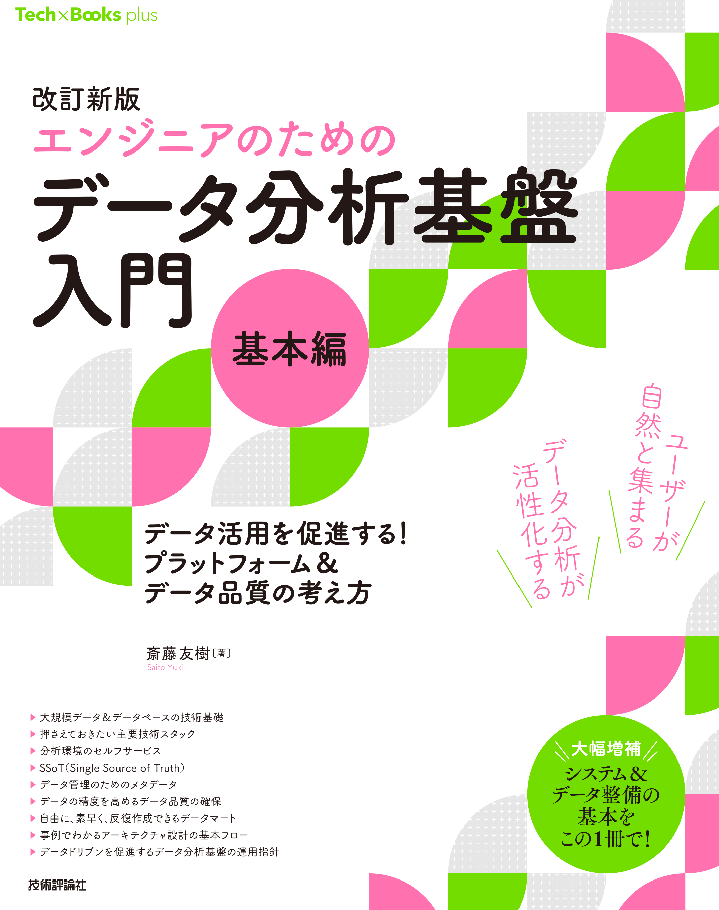

# 改訂新版［エンジニアのための］データ分析基盤入門＜基本編＞　データ活用を促進する！ プラットフォーム＆データ品質の考え方
本リポジトリは、技術評論社から出版された以下の書籍 のWeb補足情報を提供するためのものです。
書籍に関する「正誤表」や関連情報をまとめています。

  

- title : [改訂新版［エンジニアのための］データ分析基盤入門＜基本編＞　データ活用を促進する！ プラットフォーム＆データ品質の考え方](https://www.amazon.co.jp/%E6%94%B9%E8%A8%82%E6%96%B0%E7%89%88%EF%BC%BB%E3%82%A8%E3%83%B3%E3%82%B8%E3%83%8B%E3%82%A2%E3%81%AE%E3%81%9F%E3%82%81%E3%81%AE%EF%BC%BD%E3%83%87%E3%83%BC%E3%82%BF%E5%88%86%E6%9E%90%E5%9F%BA%E7%9B%A4%E5%85%A5%E9%96%80%EF%BC%9C%E5%9F%BA%E6%9C%AC%E7%B7%A8%EF%BC%9E-%E3%83%87%E3%83%BC%E3%82%BF%E6%B4%BB%E7%94%A8%E3%82%92%E4%BF%83%E9%80%B2%E3%81%99%E3%82%8B%EF%BC%81-%E3%83%97%E3%83%A9%E3%83%83%E3%83%88%E3%83%95%E3%82%A9%E3%83%BC%E3%83%A0%EF%BC%86%E3%83%87%E3%83%BC%E3%82%BF%E5%93%81%E8%B3%AA%E3%81%AE%E8%80%83%E3%81%88%E6%96%B9-%E6%96%8E%E8%97%A4-%E5%8F%8B%E6%A8%B9/dp/4297145634/ref=rvi_d_sccl_2/357-4350168-5157710?pd_rd_w=sr8Pw&content-id=amzn1.sym.a4dc92d7-7100-437e-b3e3-2349e8298523&pf_rd_p=a4dc92d7-7100-437e-b3e3-2349e8298523&pf_rd_r=H0HGY9GH197DSCGHFQ94&pd_rd_wg=rdLFd&pd_rd_r=f1b1765d-b4df-4ee6-a908-3d3e0e3f7262&pd_rd_i=4297145634&psc=1)
- Publisher : 技術評論社 (Nov. 5, 2024)
- Publication date :  Nov. 5, 2024
- Language :  Japanese
- Tankobon Softcover : 368 pages
- ISBN-10 : 4297145634
- ISBN-13  : 978-4297145637

# 本書の構成
各章のハイライトです。

第0章　［速習］データ分析基盤と周辺知識　データ分析基盤入門プロローグ
　本書を読みやすくするために基本的な技術や既存の知識とデータ分析基盤関連の技術へのつなぎ込みを行
う章です。

第1章 ［入門］データ分析基盤　データ分析基盤を取り巻く「人」「技術」「環境」
　ビッグデータの歴史や現状を紹介します。はじめに、ビッグデータ世界の概略を押さえておきましょう。

第2章 データエンジニアリングの基礎知識　4つのレイヤー
　データ分析基盤を管理する「データエンジニアリング」を想定して、職責やナレッジを含めた基礎知識を概
説します。データエンジニアリングでカバーすべき範囲は多岐にわたるため、まずは大まかにデータ分析基
盤全体を把握していきましょう。

第3章 データ分析基盤の管理＆構築　セルフサービス、SSoT、タグ、ゾーン、メタデータ管理
　データ分析基盤を構築/管理する上で大切なポイントである「セルフサービス」「SSoT」（Single source of truth）
という考え方を中心によりビジネス成果を創出しやすいデータ分析基盤に求められる役割や考え方、方法論
について解説します。

第4章 データ分析基盤の技術スタック　データソースからアクセスレイヤー、クラスター、ワークフローエンジンまで
　データ分析基盤を4つの層に分割し、それぞれの層で登場する技術スタックを紹介します。
　ユーザーがデータを利用した成果の創出に集中するためのベースとなる特定の技術スタックを取り上げて、
特徴や用途を説明します。多々あるビッグデータの技術の中から、必要性を見極めて技術選択できるように
なることを目指します。

第5章 メタデータ管理　データを管理する「データ」の重要性
　データを管理するためのメタデータを紹介します。「データの定義をSQLで都度調べている」「データが見つけづ
らい」「データが活用されない」などデータ分析基盤のユーザーの悩みを、メタデータを通して解決していきましょう。

第6章 データマート＆データウェアハウスとデータ整備　DIKWモデル、データ設計、スキーマ設計、最小限のルール
　データマートを作成し綺麗に整形することも大事ですが、単純な作成方法だけにとどまらず、ユーザーが
データマートを自由に素早く反復して作成できるようにすることが重要です。
　データ利用の一つの障壁となる人とのコミュニケーションをシンプルにするための方法についても紹介します。

第7章 データ品質管理　質の高いデータを提供する
　データの状態を常にモニタリングすることで、データの精度を高めるデータ品質管理について説明します。
間違えたデータで意思決定をしないように、データの品質を継続的に測定し、データの設計書を残し継続的
に成果の創出できるデータ分析基盤を作り上げます。

第8章 データ分析基盤から始まるデータドリブン　データ分析基盤の可視化＆測定
　データ分析基盤開発の方向を見失わないようにするために、KPI管理とKPI管理対象項目について紹介し
ます。実際のデータ分析基盤の管理/運用で活用できる項目を重点的に取り上げます。

第9章　［事例で考える］データ分析　基盤のアーキテクチャ設計　豊富な知識と柔軟な思考で最適解を目指そう
　本書の知識整理を目的として、第0章〜第8章までの知識を利用して、シンプルなユースケースを元にデ
ータ分析基盤の設計に取り組みます。サンプルコード付きです。

Appendix　［ビッグデータでも役立つ］RDB基礎講座
　ビッグデータに関する技術要素は、リレーショナルデータベース（relational database、RDB）の技術要素と通
ずるものがあります。第1章からの本編解説の理解の助けになるように、RDBの基本を解説します。

## 本書で登場するCodes
本書で登場するサンプルコードは以下に配置しております。

[codes](https://github.com/yk-st/2nd_edition_bigdataplatform_and_engineering/tree/main/codes)

# 正誤表
## 初版修正情報

# 動作環境
本書を作成時に利用した筆者の動作の確認環境は以下です。

-（ローカル環境）MacBook Pro（M1 Max, 2021）
- Docker Desktop 4.34.2（167172）
- Python 3.12.4
- Java 8（Embulkで利用） / Java17（Embulk以外, 17.0.12）
- Spark 3.5.3
※第9章（クラウド環境）ではGlue 4.0（Spark 3.2）、Glue 4.0/Python shell（Python 3.9）を使用

# 著者について
普段はデータを活用する企画業務に従事  
ビッグデータのシステム構築から活用までアドバイザリーをやっています。

- X(Twitter)：[@yuki_saito_en](https://twitter.com/yuki_saito_en)
- LinkedIn: https://www.linkedin.com/in/yuki-saito-40872b217/
- Note: https://note.com/yukinkoyuki
- MENTA(アドバイザリー):https://menta.work/member/dashboard
- Udemy(オンライン講師): https://www.udemy.com/user/yuki-saito-7/

# 本書内で紹介している書籍など
ここではビッグデータ関連書籍として、書籍内で紹介している書籍やおすすめの書籍について紹介します。

- [Spark: The Definitive Guide: Big Data Processing Made Simple (English Edition)](https://amzn.to/3nQ90ts)
- [Kafka: The Definitive Guide (English Edition)](https://amzn.to/3nNMcdU)
- [データ指向アプリケーションデザイン ―信頼性、拡張性、保守性の高い分散システム設計の原理](https://amzn.to/3tQh69g)

# その他補助になると考えられるもの
本書で頻繁に出てくるSpark(Pyspark)やKafka、メタデータストア、ストリーミングをコード中心に駆け回ってみる講座たちです。  
コードはGithubに公開していますので更に理解を深めるためにご利用ください。

# ビジネスパーソン向け他のコース
1. [**「DX(デジタルトランスフォーメーション)のためのビッグデータ活用とデータ活用企画のつくりかたまで」**](https://www.udemy.com/course/dx-bigdata/?referralCode=B9C9B09E1333C4C3FA49)
2. [**「【実戦で学ぶ速習講座】リレーショナルデータベースで始めるデータ活用とデータ分析のためのSQLを学ぼう」**](https://www.udemy.com/course/business_sql/?referralCode=24DC6166DC34A63E61A5)

# エンジニア向け他のコース情報
1. [**「データサイエンスのための前処理入門PythonとSparkで学ぶビッグデータエンジニアリング(PySpark) 速習講座」**](https://www.udemy.com/course/python-spark-pyspark/?referralCode=E67BF8B61F65866794EB)
2. [**「【PythonとSparkで始めるデータマネジメント入門】 ビッグデータレイクのための統合メタデータ管理入門」**](https://www.udemy.com/course/draft/4367192/?referralCode=AB48AD18D10E55DCB0E5)
3. [**「【データサイエンスのためのストリーミング前処理入門　PythonとSparkで始めるビッグデータストリーミング処理入門」**](https://www.udemy.com/course/python-spark-streaming/?referralCode=F5E3B429A5C47468BDAD)
4. [**「超速入門!【データサイエンスへの最初の一歩】PythonとSparkで学ぶデータ分析のための前処理と分散処理 一気見講座」**](https://www.udemy.com/course/draft/4415660/?referralCode=EF89D5D240FB483AF4A1)
5. [**「【実戦で学ぶデータ分析基盤構築講座】ローカル端末で1から始めるデータ分析基盤の構築とデータ活用のための活動」**](https://www.udemy.com/course/dataplatform_local/?referralCode=FFAE0C4DC02083D63DC9)
6. [**「【実戦で学ぶ基盤構築】ローカル端末で作り理解するエンジニアのための機械学習基盤の作成とMLOps」**](https://www.udemy.com/course/mlops-pf-and-ml/?referralCode=E6DF74BCFAE60315F390)
